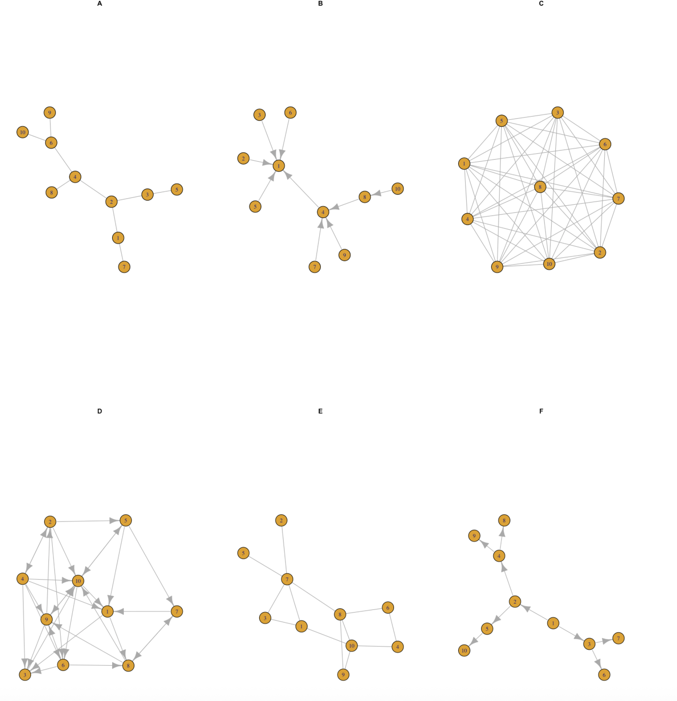

```{r setup, include=FALSE}
knitr::opts_chunk$set(echo = TRUE)
```

# Tarea 4

Antes de empezar con los scripts y actividades, es necesario cargar las librerias necesarias y/o instalarlas si aun no cuentas con ellas.

```{r message=FALSE, warning=FALSE, paged.print=FALSE}
library(igraph)
library(igraphdata)
```

## (20 %) Preguntas rápidas (simples)

1.  **Considera una red de 15 nodos que tienes una sola conexión. ¿Cuál es el número máximo de nodos que puedes conectar? Dado un solo nodo , ¿cuál es el número máximo conexiones que puede tener tal nodo?** Solo se pueden conectar 2 nodos por conexion, los demas quedan "sueltos". Sin embargo, si elegimos un solo nodo, el numero maximo de conexiones es con los otros 14 nodos, refiriendonos a una red no dirigida.

2.  **Considera una red dirigida de 10 nodos. Usa 25 conexiones y dibuja una red con ese número de nodos y conexiones dirigidas. Calcula la distribución de conectividades de salida. Calcula el número total de conexiones de salida ¿Cómo se compara el número total de de conectividades de entrada (son iguales, diferentes)? Explica tu respuesta. Calcula el promedio de entrada y de salida. Discute tu resultado.**

    ```{r}
    set.seed(1)
    red2 <- sample_gnm(n = 10, m = 25, directed = TRUE)

    plot(red2, main = "Red de ejercicio 2")

    salidas <- degree(red2, mode = "out")
    hist(salidas, main = "Grado de salida", xlab = "Salidas")
    ```

```{r}
  total_salidas <- sum(degree(red2, mode = "out"))
  total_salidas
  
  total_ingresos <- sum(degree(red2, mode = "in"))
  total_ingresos
    
  prom_salida <- mean(degree(red2, mode = "out"))
  prom_salida
    
  prom_entrada <- mean(degree(red2, mode = "in"))
  prom_entrada
```

Hay 25 conexiones, el total de salidas y entradas es igual, ya que al ser dirigida, sale de un nodo y llega a otro, esto representa una de las propiedades. Al sacar el promedio, dividimos 25 conexiones totales/10 nodos, lo que nos da 2.5 conexiones por nodo en ambos casos. Aunque el total es simetrico como podemos observar en la grafica de distribucion, hay nodos que pueden tener mas salidad o ser mas receptivos al tener mas entradas.

3.  **Considera una red no dirigida de** $n=3,4,5,6$ **nodos respectivamente. ¿Cuál es el número máximo de conexiones que puedes poner? Dibuja cada caso. ¿Qué pasa si la red es dirigida?**

    ```{r}
    n_nodos <- c(3,4,5,6)
    max_conexiones <- n_nodos * (n_nodos - 1) / 2
    max_conexiones
    ```

```{r}
red3_1 <- sample_gnm(n = 3, m = 3, directed = FALSE)
plot(red3_1, main = "3.1 red no dirigida con max conexiones - 3 nodos")
```

```{r}
red3_1 <- sample_gnm(n = 3, m = 3, directed = TRUE)
plot(red3_1, main = "3.1 red dirigida con max conexiones - 3 nodos")
```

```{r}
red3_2 <- sample_gnm(n = 4, m = 6, directed = FALSE)
plot(red3_2, main = "3.2 red no dirigida con max conexiones - 4 nodos")
```

```{r}
red3_2 <- sample_gnm(n = 4, m = 6, directed = TRUE)
plot(red3_2, main = "3.2 red dirigida con max conexiones - 4 nodos")
```

```{r}
red3_3 <- sample_gnm(n = 5, m = 10, directed = FALSE)
plot(red3_3, main = "3.3 red no dirigida con max conexiones - 5 nodos")
```

```{r}
red3_3 <- sample_gnm(n = 5, m = 10, directed = TRUE)
plot(red3_3, main = "3.3 red dirigida con max conexiones - 5 nodos")
```

```{r}
red3_4 <- sample_gnm(n = 6, m = 15, directed = FALSE)
plot(red3_4, main = "3.4 red no dirigida con max conexiones - 6 nodos")
```

```{r}
red3_4 <- sample_gnm(n = 6, m = 15, directed = TRUE)
plot(red3_4, main = "3.4 red dirigida con max conexiones - 6 nodos")
```

Una red no dirigida se representa con líneas simples entre nodos, sin flechas, lo que significa que la conexión va en ambos sentidos. En cambio, una red dirigida si se visualiza con flechas en las conexiones, mostrando hacia dónde va la relación y quien la recibe.

4.  **Considera tu red de amigos reales. ¿Cuál es tu coeficiente de clusterización?**

    ```{r echo=FALSE}
    g <- read.csv("adjacency_matrix.csv")
    rownames(g) <- g[, 1]
    g <- g[, -1]
    g <- as.matrix(g)
    diag(g) <- 0

    # Crear y bisauliza la red a partir de la matriz de adyacencia
    red_amigos <- graph_from_adjacency_matrix(g)
    plot(red_amigos, vertex.size=15, edge.arrow.size=0.25, 
         layout=layout_nicely, vertex.label.cex=0.8)
    ```

```{r}
#Coeficiente de clusterización de la red de amigos
cf_clus_amigos <- transitivity(red_amigos, type = "global")
cf_clus_amigos
```

Este coeficiente nos dice que aproximadamente el 54% de personas dentro del grupo, pueden ser amigos de otros entre ellos. Es decir, en el grupo hay una conexion moderada.

## **(80 % ) Scripts, código, texto y gráficas**

1.  **Propiedades básicas de redes**

A partir de las siguientes redes calcula manualmente las siguientes propiedades de cada red.



[Formulas requeridas:]{.underline}

-   Density: 2 \* número de aristas / n(n-1)
-   

**Red A**

-   Número de conexiones: 9

-   Número de nodos: 10

-   Degree:

    N1 - 2

    N2 - 3

    N3 - 2

    N4 - 3

    N5 - 1

    N6 - 3

    N7 - 1

    N8 - 1

    N9 - 1

    N10 - 1

-   Average degree:

    2 + 3 + 2 + 3 + 1 + 3 + 1 + 1 + 1 + 1 = 18/ 10 = **1.8**

-   Degree distribution:

    Grado 1 - 5 nodos

    Grado 2 - 2 nodos

    Grado 3 - 3 nodos

-   Density: 2×9 / (10×9) = 18 / 90 = 0.2

-   Nodos más distantes:

    N10 a N7

    N10 a N5

    N9 a N5.

-   Coeficiente de clusterización: 0 (no hay triangulaciones)

**Red B**

-   Número de conexiones: 9

-   Número de nodos: 10

-   Degree:

    N1 - 5

    N2 - 2

    N3 - 1

    N4 - 4

    N5 - 1

    N6 - 1

    N7 - 1

    N8 - 2

    N9 - 1

    N10 - 1

-   Average degree:

    5 + 2 + 1 + 4 + 1 + 1 + 1 + 2 + 1 + 1 = 19 / 10 = **1.9**

-   Degree distribution:

    Grado 1 - 6 nodos

    Grado 2 - 2 nodos

    Grado 3 - 0 nodos

    Grado 4 - 1 nodo

    Grado 5 - 1 nodo

-   Density: 2×9 / (10×9) = 18 / 90 = 0.2

-   Nodos más distantes:

    N10 a N1

-   Coeficiente de clusterización: 0 (no hay triangulaciones)

**Red C**

-   Número de conexiones: 45

-   Número de nodos: 10

-   Degree:

    N1 - 9

    N2 - 9

    N3 - 9

    N4 - 9

    N5 - 9

    N6 - 9

    N7 - 9

    N8 - 9

    N9 - 9

    N10 - 9

-   Average degree:

    9 x 10 = 90 / 10 = 9

-   Degree distribution:

    Grado 9 - 10 nodos

-   Density: 2×45 / (10×9) = 90 / 90 = 1

-   Nodos más distantes: cualquiera, todos estan a la misma distancia.

-   Coeficiente de clusterización: 1

**Red D**

-   Número de conexiones: 30

-   Número de nodos: 10

-   Degree:

    N1 - 6

    N2 - 6

    N3 - 5

    N4 - 7

    N5 - 5

    N6 - 6

    N7 - 4

    N8 - 6

    N9 - 6

    N10 - 9

-   Average degree:

    6 + 6 +5 + 7 + 5 + 6 + 4 + 6 + 6 + 9 =60 / 10 = 6

-   Degree distribution:

    Grado 4 - 1 nodos

    Grado 5 - 2 nodos

    Grado 6 - 5 nodos

    Grado 7 - 1 nodos

    Grado 9 - 1 nodo

-   Density: 60 / (10 × 9) = 60 / 90 = 0.6 / 2 = **0.3333**

-   Nodos más distantes: todos tienen la misma distancia.

-   Coeficiente de clusterización: 0.64

**Red E**

-   Número de conexiones: 13

-   Número de nodos: 10

-   Degree:

    N1 - 3

    N2 - 1

    N3 - 2

    N4 - 2

    N5 - 1

    N6 - 2

    N7 - 5

    N8 - 4

    N9 - 2

    N10 - 4

-   Average degree:

    3 + 1 + 2 + 2 + 1 + 2 + 5 + 4 + 2 + 4 = 26 / 10 = **2.6**

-   Degree distribution:

    Grado 1 - 2 nodos

    Grado 2 - 4 nodos

    Grado 3 - 1 nodo

    Grado 4 - 2 nodos

    Grado 5 - 1 nodo

-   Density: 2 x 13 / (10 × 9) = 26 / 90 = **0.289**

-   Nodos más distantes:

    N5 a N4

    N2 a N4

    N2 a N9

-   Coeficiente de clusterización: 0.345

**Red F**

-   Número de conexiones: 9

-   Número de nodos: 10

-   Degree:

    N1 - 2

    N2 - 3

    N3 - 3

    N4 - 3

    N5 - 2

    N6 - 1

    N7 - 1

    N8 - 1

    N9 - 1

    N10 - 1

-   Average degree:

    2 + 3 + 3 + 3 + 2 + 1 + 1 + 1 + 1 + 1 = 18 / 10 = **1.8**

-   Degree distribution:

    Grado 1 - 5 nodos

    Grado 2 - 2 nodos

    Grado 3 - 3 nodo

-   Density: 9 / (10 × 9) = 9 / 90 = 0.1

-   Nodos más distantes:

    N1 a N10

    N1 a N9

    N1 a N8

-   Coeficiente de clusterización: 0

Después escribe **código en R** que genere las gráficas de las redes y que calcule las propiedades anteriores para cada red.

**Red A**

```{r}
# Crear red A
edges_A <- c(1,2, 1,7, 2,3, 2,4, 3,5, 4,6, 4,8, 6,9, 6,10)
gA <- make_graph(edges_A, directed = FALSE)
plot(gA)

# Número de nodos
vcount(gA)

# Número de conexiones
ecount(gA)

# Grado de cada nodo
degree(gA)

# Grado promedio
mean(degree(gA))

# Distribución del grado
table(degree(gA))

# Histograma del grado
hist(degree(gA))

# Densidad
edge_density(gA)

# Matriz de adyacencia
as.matrix(as_adjacency_matrix(gA))

# Matriz de distancias
distances(gA)

# Diámetro
diameter(gA)

# Nodos más distantes
get_diameter(gA)

# Coeficiente de clustering
transitivity(gA, type = "average")
```

**Red B**

```{r}
# Crear red B (dirigida)
edges_B <- c(2,1, 3,1, 5,1, 6,1, 1,4, 7,4, 9,4, 4,8, 10,8)
gB <- make_graph(edges_B, directed = TRUE)
plot(gB)

# Número de nodos
vcount(gB)

# Número de conexiones
ecount(gB)

# Grado de cada nodo
degree(gB, mode = "all")

# Grado promedio
mean(degree(gB, mode = "all"))

# Distribución del grado
table(degree(gB, mode = "all"))

# Histograma del grado
hist(degree(gB, mode = "all"))

# Densidad
edge_density(gB, loops = FALSE)

# Matriz de adyacencia
as.matrix(as_adjacency_matrix(gB))

# Matriz de distancias
distances(gB)

# Diámetro
diameter(gB)

# Nodos más distantes
get_diameter(gB)

# Coeficiente de clustering
transitivity(gB, type = "average")
```

**Red C**

```{r}
# Crear red C (no dirigida)
gC <- make_full_graph(n = 10, directed = FALSE)
plot(gC)

# Número de nodos
vcount(gC)

# Número de conexiones
ecount(gC)

# Grado de cada nodo
degree(gC, mode = "all")

# Grado promedio
mean(degree(gC, mode = "all"))

# Distribución del grado
table(degree(gC, mode = "all"))

# Histograma del grado
hist(degree(gC, mode = "all"))

# Densidad
edge_density(gC, loops = FALSE)

# Matriz de adyacencia
as.matrix(as_adjacency_matrix(gC))

# Matriz de distancias
distances(gC)

# Diámetro
diameter(gC)

# Nodos más distantes
get_diameter(gC)

# Coeficiente de clustering
transitivity(gC, type = "average")
```

**Red D**

```{r}
# Crear red D (dirigida)
edges_D <- c(1,3, 1,8, 2,10, 2,5, 2,6,2,4,4,2, 3,10, 4,3, 4,6, 4,9, 4,1, 4,10, 5,7, 5,1,5,10, 10,5, 6,3, 6,8, 6,9, 7,1, 7,8, 8,7, 8,9, 8,10, 9,3, 9,2, 10, 6, 10,1, 10,9)
gD <- make_graph(edges_D, directed = TRUE)
plot(gD)

# Número de nodos
vcount(gD)

# Número de conexiones
ecount(gD)

# Grado de cada nodo
degree(gD, mode = "all")

# Grado promedio
mean(degree(gD, mode = "all"))

# Distribución del grado
table(degree(gD, mode = "all"))

# Histograma del grado
hist(degree(gD, mode = "all"))

# Densidad
edge_density(gD, loops = FALSE)

# Matriz de adyacencia
as.matrix(as_adjacency_matrix(gD))

# Matriz de distancias
distances(gD)

# Diámetro
diameter(gD)

# Nodos más distantes
get_diameter(gD)

# Coeficiente de clustering
transitivity(gD, type = "average")
```

**Red E**

```{r}
# Crear red E (no dirigida)
edges_E <- c(1,3, 1,7, 1,10, 2,7, 3,7, 4,6, 4,10, 5,7, 6,8, 7,8, 8,9, 8,10, 9,10)
gE <- make_graph(edges_E, directed = FALSE)
plot(gE)

# Número de nodos
vcount(gE)

# Número de conexiones
ecount(gE)

# Grado de cada nodo
degree(gE, mode = "all")

# Grado promedio
mean(degree(gE, mode = "all"))

# Distribución del grado
table(degree(gE, mode = "all"))

# Histograma del grado
hist(degree(gE, mode = "all"))

# Densidad
edge_density(gE, loops = FALSE)

# Matriz de adyacencia
as.matrix(as_adjacency_matrix(gE))

# Matriz de distancias
distances(gE)

# Diámetro
diameter(gE)

# Nodos más distantes
get_diameter(gE)

# Coeficiente de clustering
transitivity(gE, type = "average")
```

**Red F**

```{r}
# Crear red F (dirigida)
edges_F <- c(1,3, 1,2, 2,4,2,5, 3, 7, 3,6, 4,9, 4,8, 5,10)
gF <- make_graph(edges_F, directed = TRUE)
plot(gF)

# Número de nodos
vcount(gF)

# Número de conexiones
ecount(gF)

# Grado de cada nodo
degree(gF, mode = "all")

# Grado promedio
mean(degree(gF, mode = "all"))

# Distribución del grado
table(degree(gF, mode = "all"))

# Histograma del grado
hist(degree(gF, mode = "all"))

# Densidad
edge_density(gF, loops = FALSE)

# Matriz de adyacencia
as.matrix(as_adjacency_matrix(gF))

# Matriz de distancias
distances(gF)

# Diámetro
diameter(gF)

# Nodos más distantes
get_diameter(gF)

# Coeficiente de clustering
transitivity(gF, type = "average")
```

1.  **Karate**

Considera la red del club de Karate de Zachary. [Acá](https://en.wikipedia.org/wiki/Zachary%27s_karate_club) puedes leer sobre eso. En igraph la gráfica está precargada.

```{r}
library(igraph)
karate<-make_graph("Zachary")
plot(karate)
```

-   **¿Cuántos nodos y conexiones tiene?** tiene 34 nodos y 78 conexiones

    ```{r}
    # Nodos
    vcount(karate)

    # Conexiones
    ecount(karate)
    ```

    -   **¿Quiénes son los nodos y cuál es la regla de conexión?** los nodos son los 34 miembros que pertenecian a un grupo de karate de una universidad en Estados Unidos en 1970. La regla de conexion era la amistad entre ellos, si se llevaban o no, perteneciendo a una red no dirigida.

-   **¿Qué tan densa es la red?** tiene una densidad de 0.1390374, esto significa que solo el 13.9% de todas las conexiones posibles existen. La mayoria de los miembros no estan conectados directamente entre ellos.

    ```{r}
    edge_density(karate)
    ```

-   **¿Cómo obtienes la matriz de adyacencia?**

    ```{r}
    as.matrix(as_adjacency_matrix(karate))
    ```

-   **¿Es una red dirigida, pesada?** Es una red NO dirigida, ya que no tiene flechas, por lo tanto, tampoco se puede decir si es pesada o no.

-   **Calcula y gráfica la distribución de conectividades.**

    ```{r}
    d_conetividad <- degree(karate)
    hist(d_conetividad,main = "Distribución de grado - Karate",
         xlab = "Grado",
         ylab = "Frecuencia",
         col = "skyblue" )
    ```

-   **Calcula el diámetro, la matriz de distancias y la distancia promedio.**

    El diametro de 5 nos dice que aunque no todos están conectados directamente, se puede llegar a cualquier persona desde otra en como máximo 5 pasos. Aunque en promedio, se necesitan alrededor de 2.4 pasos para llegar de un nodo a otro.

    ```{r}
    # Diámetro
    diameter(karate)

    # Matriz de distancias
    distances(karate)

    # Distancia promedio
    mean_distance(karate)
    ```

-   **Encuentra la trayectoria de los nodos más alejados.** Empezamos en el nodo **15** -\> 33 -\> 3 -\> 1 -\> 6 -\> hasta llegar al nodo **17**.

    ```{r}
    get_diameter(karate)
    ```

-   **Existen nodos con coefeiciente de clusterización 1. ¿Qué significa?**

    significa que el nodo y todos sus vecinos estan conectados entre si.

-   **Mide , con al menos tres medidas de centralidad, los nodos más importantes.**

    ```{r}
    # Centralidad de grado, nos dice la conectividad directa.  Cuanto mayor es el grado, más central es el nodo en cuanto a acceso directo a otros.
    deg_cent <- degree(karate)
    deg_cent

    # Centralidad de cercanía, nos dice la rapidez para alcanzar otros nodos, esto es bueno cuando queremos difundir información.
    clo_cent <- closeness(karate)
    clo_cent

    # Centralidad de intermediación, nos habla del control sobre el flujo de información.  Los nodos con alta intermediación actuan como puentes, tienen poder de conexión.
    bet_cent <- betweenness(karate)
    bet_cent
    ```

[Se explicaron e interpretaron los resultados en cada paso.]{.underline}

2.  **Amigues**

A partir de la red de amigues que vimos en clase, en su versión no ponderada, contesta lo siguiente:

```{r echo=FALSE}
# Cargar la matriz de adyacencia desde CSV
g <- read.csv("adjacency_matrix.csv")
rownames(g) <- g[, 1]
g <- g[, -1]
g <- as.matrix(g)
diag(g) <- 0  # Asegurarse de que no haya lazos
g <- (g + t(g)) > 0 # Forzar la simetría de la matriz
g <- 1 * g  # Convierte valores lógicos a 0 y 1


# Crear red no ponderada desde matriz de adyacencia
red_amigos <- graph_from_adjacency_matrix(g, mode = "undirected", weighted = FALSE)

# Visualizar la red (sin pesos)
plot(red_amigos, 
     vertex.size = 15, 
     edge.arrow.size = 0.25, 
     layout = layout_nicely, 
     vertex.label.cex = 0.8)
```

-   **Escribe una función que calcule el número de amigos que tiene cualquier persona arbitraria y lo compare con el número de los amigos de estos.**

    ```{r}
    # Función: Número de amigos y amigos de los amigos
    amigos_y_amigos_de_amigos <- function(g, persona) {
      amigos <- neighbors(g, persona)
      num_amigos <- length(amigos)
      
      # Amigos de los amigos
      amigos_de_amigos <- unique(unlist(lapply(amigos, function(x) neighbors(g, x))))
      amigos_de_amigos <- setdiff(amigos_de_amigos, persona)  
      num_amigos_de_amigos <- length(amigos_de_amigos)
      
      cat("La persona", persona, "tiene", num_amigos, "amigos directos y",
          num_amigos_de_amigos, "amigos de sus amigos.\n")
    }

    # Ejemplo de uso conmigo misma:
    amigos_y_amigos_de_amigos(red_amigos, 8)

    ```

-   **Escribe una función que te de la trayectoria más larga entre dos nodos arbitrarios de la red.**

    ```{r}
    trayectoria_mas_larga <- function(g, nodo1, nodo2) {
      # Obtiene el camino más corto (longitud máxima entre nodo1 y nodo2)
      path <- shortest_paths(g, from = nodo1, to = nodo2)$vpath[[1]]
      
      cat("La trayectoria entre", nodo1, "y", nodo2, "es:\n")
      print(path)
      cat("Longitud de la trayectoria:", length(path) - 1, "\n")
    }

    #ejemplo de uso entre Alondra y Michelle
    trayectoria_mas_larga(red_amigos, 2, 15)

    ##no entendi esta parte del ejercicio, me ayudo la IA a corregir.
    ```

-   **Encuentra las dos personas más populares.**

    ```{r}
    popus <- sort(degree(red_amigos), decreasing = TRUE)
    top_populares <- head(popus, 2)
    top_populares
    ```

3.  **Red PPI**

A partir de la red de interacción proteína-proteína (PPI) de la levadura que se encuentra en la bilbioteca `igraphdata` Elabora un script que conteste lo siguiente:

```{r echo=FALSE}
library(igraph)
library(igraphdata)

data("yeast")
red_levadura <- yeast
plot(red_levadura)
```

-   **Encuentre qué tipo de distribución de conectividades tiene. Haz un ajuste en log-log para ver que tipo de distribución podría ser.**

    ```{r echo=FALSE}
    grados <- degree(red_levadura)
    hist_data <- table(grados)
    plot(as.numeric(names(hist_data)), as.numeric(hist_data),
         log = "xy", col = "black", pch = 20,
         xlab = "Grado (log)", ylab = "Frecuencia (log)",
         main = "Distribución de conectividades en escala log-log")

    # Ajuste lineal en log-log para identificar patrón tipo ley de potencias
    logx <- log10(as.numeric(names(hist_data)))
    logy <- log10(as.numeric(hist_data))
    modelo <- lm(logy ~ logx)
    abline(modelo, col="red")

    summary(modelo)

    ```

El ajuste tiene una pendiente negativa significativa ya que es [\~ -1.53]{.underline}, lo cual sugiere una **distribución tipo ley de potencia**, tambien podemos ver que el ajuste es bueno ([R² ≈ 0.87]{.underline}), **esto significa que los grados de los nodos siguen una distribución de cola larga**: pocos nodos muy conectados, muchos con pocas conexiones.

-   **Encuentra las diez proteínas más conectadas**

```{{r}}
popus_proteinas_yeast <- sort(grados, decreasing = TRUE)[1:10]
popus_proteinas_yeast
```

-   **Calcula el diámetro y promedio de las distancias.**

    ```{r}
    diametro_red_levadura <- diameter(red_levadura)
    diametro_red_levadura

    dist_prom_levadura <- mean_distance(red_levadura)
    dist_prom_levadura
    ```

    Aunque hay pares de proteínas que pueden estar hasta 15 pasos alejadas, en general, la red está bastante conectada. Una distancia promedio de 5.095629 quiere decir que la red es eficiente para interactuar entre proteínas, a pesar de su gran tamaño.

-   **Crea una función que, a partir de eliminar al azar un nodo de la red genere el promedio de las distancias después de eliminar** $n=1,2,3,\ldots, 100$ **nodos al azar.**

    ```{r}
    #No logre hacerlo, muy dificil:(

    ```

-   **Crea una función que elimine las proteínas más conectadas y calcule el promedio de las distancias cada vez que se remueve un nodo.**

    ```{r}
    #No logre hacerlo, muy dificil:( x2

    ```

-   **Calcula el promedio del coeficiente de clusterización. ¿Hay proteínas que tengan un coeficiente de clusterización de 1? Eso qué significa.** Si hay con coeficiente de 1, como se menciona en otro ejecicio de mas arriba, esto significa que todos los vecinos de ese nodo están conectados entre sí. Refiriendonos en este caso a proteinas, puede ser que ese grupo forma un complejo unido, como por ejemplo que participan en una misma función.

    ```{r}
    # Calcular coeficiente de clusterización promedio
    clust_coef <- transitivity(red_levadura, type = "local", isolates = "zero")
    prom_clust_coef <- mean(clust_coef, na.rm = TRUE)
    prom_clust_coef


    # ¿Cuántos nodos tienen coeficiente de clusterización igual a 1?
    sum(clust_coef == 1)
    ```

4.  **Redes biológicas**

Ve a al [Network Repository](https://networkrepository.com/bn-mouse-visual-cortex-1.php) y descarga la red en formato lista de adyacencia. Explica que representam los nodos y las conectividades.

Escribe código que resuelva lo siguiente:

-   Cargue y genere una gráfica en `igraph`.

    ```{r echo=FALSE}
    # Cargar el archivo .edges
    edges_file <- "bn-mouse_visual-cortex_1/bn-mouse_visual-cortex_1.edges"
    edges <- read.table(edges_file)

    # Crear una lista de adyacencia
    adjacency_list <- list()

    for (i in 1:nrow(edges)) {
      node1 <- edges[i, 1]
      node2 <- edges[i, 2]
      
      # Agregar conexiones en la lista de adyacencia
      if (!(node1 %in% names(adjacency_list))) {
        adjacency_list[[as.character(node1)]] <- c()
      }
      if (!(node2 %in% names(adjacency_list))) {
        adjacency_list[[as.character(node2)]] <- c()
      }
      
      adjacency_list[[as.character(node1)]] <- c(adjacency_list[[as.character(node1)]], node2)
      adjacency_list[[as.character(node2)]] <- c(adjacency_list[[as.character(node2)]], node1)
    }

    # Convertir la lista de adyacencia a un formato adecuado para guardar en un archivo .adj
    edges_list <- data.frame()
    for (node in names(adjacency_list)) {
      for (neighbor in adjacency_list[[node]]) {
        # Asegurarse de que las aristas sean bidireccionales (evitar duplicados)
        if (as.character(node) < as.character(neighbor)) {
          edges_list <- rbind(edges_list, data.frame(node1 = node, node2 = neighbor))
        }
      }
    }

    # Guardar la lista de aristas en un archivo .adj
    adj_file <- "bn-mouse_visual-cortex_1.adj"
    write.table(edges_list, adj_file, quote = FALSE, row.names = FALSE, col.names = FALSE)

    # Ver la lista de aristas guardada
    print(edges_list)

    #para esta parte use la IA, pq no tenia ni idea de como visulizarlo, ya que me descagaba un archivo .edges y yo ocupaba la matriz.
    ```

    ```{r}
    library(igraph)

    # Cargar la red desde el archivo .adj
    gMVC <- read_graph("bn-mouse_visual-cortex_1.adj", format = "ncol", directed = FALSE)

    # Numero de nodos
    vcount(gMVC)
    # Numero de conexiones
    ecount(gMVC)

    # Graficar la red
    plot(gMVC, main = "Red Mouse_visual-cortex")

    ```

-   **Genera la gráfica con todos los layouts disponibles.** Estos fueron sacados de la siguiente pagina: <https://cran.r-project.org/web/packages/igraph/vignettes/igraph_ES.html>

    ```{r}
    # Configurar espacio de gráficos, para visulizar todos juntos
    par(mfrow = c(3, 3), mar = c(1, 1, 2, 1))  # 3x3 con espacio para títulos

    # Lista de layouts seleccionados, con comentarios explicativos
    layouts <- list(
      layout_randomly = layout_randomly,          # Coloca los vértices de forma totalmente aleatoria
      layout_in_circle = layout_in_circle,        # Disposición determinista que coloca los vértices en un círculo
      layout_on_sphere = layout_on_sphere,        # Disposición determinista que coloca los vértices en la superficie de una esfera
      layout_with_drl = layout_with_drl,          # Algoritmo DRL (Distributed Recursive Layout) para grafos grandes
      layout_with_fr = layout_with_fr,            # Algoritmo Fruchterman-Reingold (fuerzas dirigidas)
      layout_with_kk = layout_with_kk,            # Algoritmo Kamada-Kawai (fuerzas dirigidas, más rígido)
      layout_with_lgl = layout_with_lgl,          # Algoritmo LGL (Large Graph Layout) para grafos grandes
      layout_as_tree = layout_as_tree,            # Diseño de árbol de Reingold-Tilford, útil para grafos (casi) arbóreos
      layout_nicely = layout_nicely               # Elige automáticamente un layout según la estructura del grafo
    ) 

    # Graficar la red con cada layout
    for (name in names(layouts)) {
      layout_func <- layouts[[name]]
      plot(gMVC, layout = layout_func(gMVC), main = name, vertex.size = 3, vertex.label = NA)
    }
    ```

-   Grafica la red con al menos tres medidas de centralidad.

    ```{r}
    # Centralidad: grado (número de conexiones)
    deg <- degree(gMVC)

    # Centralidad: intermediación (cuántos caminos pasan por cada nodo)
    btw <- betweenness(gMVC)

    # Centralidad: cercanía (qué tan cerca está de todos los demás nodos)
    cls <- closeness(gMVC)

    # Gráficas
    par(mfrow = c(1, 3))

    plot(gMVC, vertex.size = deg*2, vertex.label = NA, 
         main = "Centralidad - Grado")

    plot(gMVC, vertex.size = btw*0.1, vertex.label = NA,
         main = "Centralidad - Intermediación")

    plot(gMVC, vertex.size = cls*100, vertex.label = NA,
         main = "Centralidad - Cercanía")
    ```

    La [centralidad de grado]{.underline} se observa que algunos nodos destacan por su tamaño, indicando que tienen muchas conexiones directas.

    La [centralidad de intermediación]{.underline}, identifica los nodos que actúan como puentes entre diferentes partes de la red. Los nodos que sobresalen, indican que ciertas conexiones pasan frecuentemente por ellos. Esto los convierte en actores importantes para la conectividad general.

    La [centralidad de cercanía]{.underline}, en este caso, la mayoría de los nodos presentan tamaños similares, por lo que están a una distancia parecida de los demás nodos, no hay un nodo claramente más central que los otros.

-   **¿Qué tan densa es la red?** si es un poco densa, alrededor del 10.8% de todas las conexiones posibles entre nodos están presentes.

    ```{r}
    densidad_mouse <- edge_density(gMVC)
    densidad_mouse
    ```

-   **Clusteriza la red con al menos tres métodos de clusterización. Gráfica la red con esos métodos.**

    ```{r}
    # Método 1: componentes conectados
    comp <- components(gMVC)

    # Método 2: Louvain (agrupa por comunidades)
    cl_louvain <- cluster_louvain(gMVC)

    # Método 3: por intermediación (edge betweenness)
    cl_btw <- cluster_edge_betweenness(gMVC)

    # Gráficas
    par(mfrow = c(1, 3))

    plot(gMVC, vertex.color = comp$membership, vertex.label = NA, 
         main = "Componentes conectados")

    plot(gMVC, vertex.color = membership(cl_louvain), vertex.label = NA,
         main = "Clusters - Louvain")

    plot(gMVC, vertex.color = membership(cl_btw), vertex.label = NA,
         main = "Clusters - Intermediación")
    ```

Se aplicaron tres métodos de clusterización para detectar comunidades dentro de la red. Primero, se observó que la red completa es un único componente conectado, es decir, no hay nodos completamente aislados. Luego, se aplicó el algoritmo de Louvain, que agrupa los nodos según su densidad de conexiones internas. Este método detectó al menos cuatro comunidades bien definidas. Por último, se usó el método de intermediación (betweenness), que divide la red cortando las conexiones más centrales. Aunque detecta una partición distinta, también revela una estructura de comunidad.

5.  **Red de coexpresión simulada**

Simula una matriz de expresión con 20 genes en 6 condiciones diferentes.

```{r echo=FALSE}
set.seed(123) 
expresion <- matrix(rnorm(20*6, mean = 10, sd = 2), nrow = 20, ncol = 6)

# Le damos nombres.
rownames(expresion) <- LETTERS[1:20]  
colnames(expresion) <- paste0("Cond", 1:6)
```

-   **Calcula la correlación entre todos los pares de genes.**

```{r}
# Usamos la transposicion porque queremos correlaciones entre genes
cor_matrix <- cor(t(expresion))
cor_matrix

```

-   **Construye** **una red de coexpresión utilizando un umbral de correlación \> 0.8.**

    ```{r}
    # Matriz de adyacencia con condicion 
    adj_matrix <- (cor_matrix > 0.8) 

    # Creamos la red
    g5 <- graph_from_adjacency_matrix(adj_matrix, mode = "undirected", diag = FALSE)

    # Graficamos la red
    plot(g5, main = "Red de Coexpresión con correlación > 0.8")
    ```

-   Calcula la distribución de grados.

```{r}
grados_g5 <- degree(g5)

# Histograma de los grados
hist(grados_g5, col = "pink", main = "Distribución de grados", xlab = "Grado")

```

-   Identifica si hay módulos o agrupamientos de genes altamente correlacionados.

```{r}
#Louvain para detectar comunidades
clust_expr <- cluster_louvain(g5)

# Graficamos con colores por módulo
plot(g5, vertex.color = membership(clust_expr), vertex.label = V(g5)$name,
     main = "Módulos de coexpresión")
```

-   **Visualiza la red y discute qué tipo de topología tiene:** La red quedó MUY desconectada, solo unos pocos genes tienen enlaces, como C y F, asi como D y E. La mayoría no está correlacionada con nadie porque el umbral fue alto (\>0.8). Por eso también salen muchos módulos (colores) que estan separados. La topología es dispersa, no hay genes centralizados, y no se ve una estructura clara.

6.  **Comparación de redes**

Construye dos redes. Para ambas cada una compara su grado promedio, distribución de grados, coeficiente de clusterización y diámetro.

-   Una red aleatoria tipo Erdos-Rényi.

    ```{r}
    set.seed(42)  # Fijamos una semilla para reproducibilidad
    red_ER <- sample_gnp(100, 0.05, directed = FALSE)

    # Grado promedio
    grado_promedio_ER <- mean(degree(red_ER))
    grado_promedio_ER

    # Distribución de grados
    hist(degree(red_ER), main = "Distribución de Grados - Erdos-Rényi", xlab = "Grado")

    # Coeficiente de clusterización
    coef_cluster_ER <- transitivity(red_ER, type = "global")
    coef_cluster_ER

    # Diámetro
    diametro_ER <- diameter(red_ER)
    diametro_ER

    ```

-   Una red tipo "scale-free" usando el modelo Barabási–Albert.

    ```{r}
    red_BA <- sample_pa(100, m = 3, directed = FALSE)

    # Grado promedio
    grado_promedio_BA <- mean(degree(red_BA))
    grado_promedio_BA

    # Distribución de grados
    hist(degree(red_BA), main = "Distribución de Grados - Barabási–Albert", xlab = "Grado")

    # Coeficiente de clusterización
    coef_cluster_BA <- transitivity(red_BA, type = "global")
    coef_cluster_BA

    # Diámetro
    diametro_BA <- diameter(red_BA)
    diametro_BA
    ```

-   Interpreta las diferencias en el contexto de redes biológicas.

```{r echo=FALSE}
# Crear la tabla de resumen con los resultados obtenidos
resultados <- data.frame(
  Propiedad = c("Grado Promedio", "Coeficiente de Clusterización", "Diámetro"),
  "Red Erdos-Rényi" = c(grado_promedio_ER, coef_cluster_ER, diametro_ER),
  "Red Barabási–Albert" = c(grado_promedio_BA, coef_cluster_BA, diametro_BA)
)

resultados
```

Después de ver los resultados, se notan diferencias que cuadran bastante con lo que se ve en redes biológicas reales, por ejemplo:

En el [grado promedio]{.underline} en la red Barabási–Albert fue más alto que en la Erdos-Rényi. Eso pasa porque el modelo Barabási crea nodos que tienen muchas conexiones, conocidos como "hubs". Y eso lo vemos como cuando hay proteínas súper conectadas que interactúan con muchas otras, parecidad a un cento de calidad.

El [coeficiente de clusterización]{.underline} también fue más alto en la red BA. No fue una diferencia enorme, pero sí se nota. Esto significa que hay más grupos donde los nodos están conectados entre sí, como si fueran mini comunidades, mejor conocidos como clusters. En redes de genes, eso se puede ver cuando ciertos genes trabajan juntos para una función específica.

En el [diámetro]{.underline} fue bien claro: 4 en la red BA y 7 en la red ER. Recordemos que esta cifra nos quiere decir que cualquier nodo puede llegar a otro con menos pasos, siendo la en la red BA mas factible. Es como si todo estuviera más accesible

En resumen, la red Barabási–Albert se parece más a cómo funcionan las redes reales en el area biologica. Ya que aqui si se tiene hubs, módulos, y distancias más cortas entre los nodos. La Erdos-Rényi es más aleatoria y simetrica, pero no captura tan bien todo lo que conllevan los sistemas biológicos.
